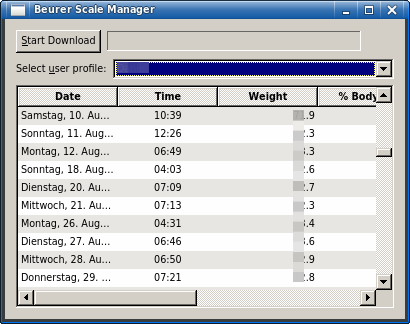

Linux manager for USB scale from Beurer: weight, body fat, water and muscle measurements.
=========================================================================================

This repository is not the source itself. It is only the code for building a working AppImage.

Sources
-------

The sources come from https://github.com/Urban82/BeurerScaleManager.

The License of the original source code, referenced by the submodule "src", is GPLv3

There are no code changes from my side on that original code.

Notes
-----

AppImage has extra support for packing qt5 code. Unfortunately, this is qt4 code, and I had to do some hacks to get it working. See build.sh.
This is also the reason why I built this AppImage. The original code compiles for Ubuntu 14.04, newer versions lack support for qt4. This package has successfully been tested unter Ubuntu 22.04 though.

License
-------

I publish this unter MIT licence. Use this repo (the packaging project) whereever you want, and for whatever you want. Take it as inspiration for your own piece of software.
Anyway, I'm always happy to hear if my code was used somewhere. Or if you mention my name there. But no requirement.
